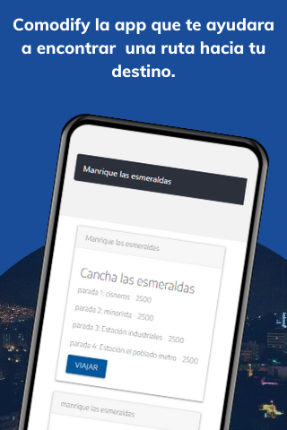
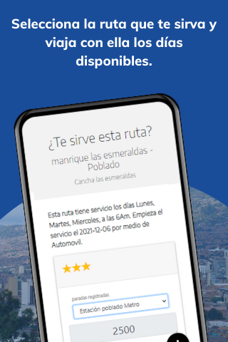
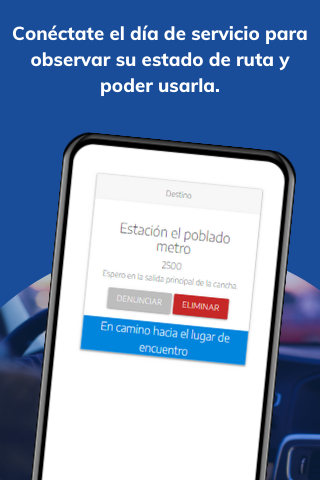
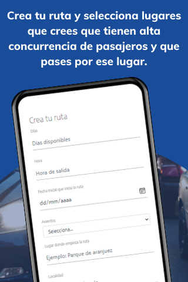

# Comodify

Comodify es una aplicación que ofrece a conductores publicar su ruta, sus paradas para que otras personas que esten cerca a ellos las puedan visualizar y puedan usarla de manera que los pasajeros paguen el valor que el conductor les compartio.

## Tools

- Nodejs
- Mysql
- Babel
- Docker
- Boostrat 5

